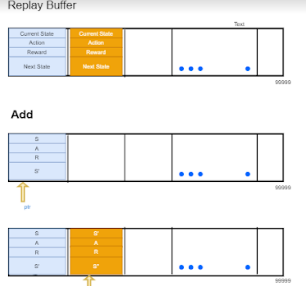
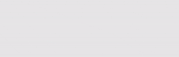
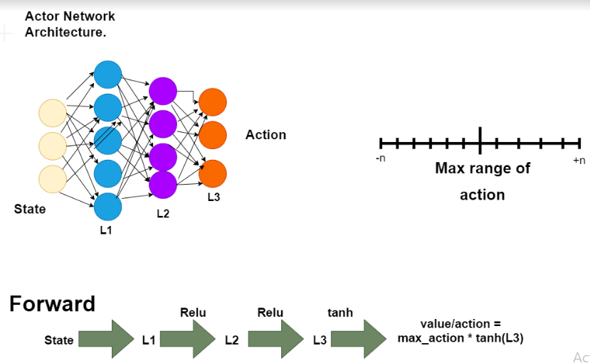
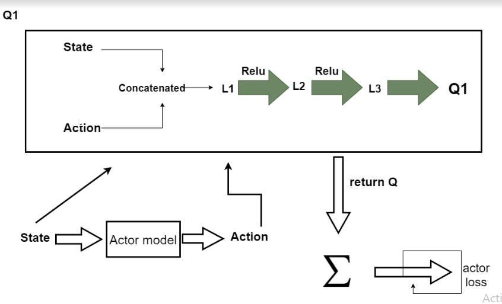
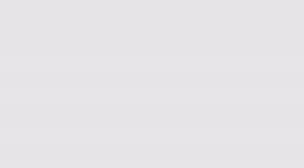

Twin Delay DDPG Model

------------------------

One of the limitations of DDPG is with respect to hyperparameters and other kinds of tuning. The reason behind that is that the learned Q-function begins to overestimate Q-values largely, which leads to the policy breaking. However Twin Delayed DDPG (T3D) addresses this issue by introducing three factors:

# Clipped Double-Q Learning.

The first feature added to T3D is the use of two critic networks. This was inspired by the technique seen in Deep Reinforcement Learning with Double Q-learning. T3D learns two Q-functions instead of one (hence &quot;twin&quot;), and uses the smaller of the two Q-values to form the targets in the Bellman error loss functions.

 # &quot;Delayed&quot; Policy Updates.

 Target networks are a great tool for introducing stability to an agents training, however in the case of actor critic methods there are some issues to this technique.T3D updates the policy (and target networks) less frequently than the Q-function. The paper recommends one policy update for every two Q-function updates.

# Target Policy Smoothing.

The final portion of T3D looks at smoothing the target policy.T3D adds noise to the target action, to make it harder for the policy to exploit Q-function errors by smoothing out Q along changes in action.

# Step 1

1. We initialize the Experience Replay Memory with the size of 1e6

2. Then we populate it with new transitions

# \_\_init\_\_ Function  :

1. Allocates the storage for replay buffer

2. defines the variable to hold max size of the replay buffer and

3. resets pointer to the beginning of the replay buffer

# Add Function:

This function adds the transitions to the Replay buffer sequentially

1. If the length of the storage is equal to the maximum size defined for the replay buffer then the pointer gets reset to the starting location and starts overwriting the new records with old saved ones sequentially

2. If not then the transactions are appended to the storage (Replay buffer)

# Sample Function

This function returns a random subset of Replay memory based on the given batch size

1.Define empty lists to store current state, next state, actions, rewards and done

2. select random numbers of size &quot;batch size&quot; in a range of 0 to length of replay buffer

3. For each random number

• Read each of the above sequentially from the storage (Replay Buffer)

• Append the fetched data into the respective lists

4.Return the data to the calling function

STEP2

-------

Build a Model for Actor Model and Actor Target. As we are building the same model for both hence the definition is also the same.

Look at the third line of the forward function which takes the x value and apply the tanh function to keep it between -1 and +1 and then multiplying that with the max action which helps them to take exactly the same angle.

Step3

-------

We are creating 2 Critic models here. We have 2 critic here as the dimensions are different

It takes the input as

State dims  - State parameters

action\_dims - How many actions can be taken

max\_action  - Not required as it&#39;s going to come from

There are 2 forward functions as well. One for each Critic model

x - state , u-action

1 for vertical concatenation #0 for Horizontal concatenation

# Q1 Function

Here we are planning to take the first critic to train the actor. It depends on the programmer, we can take critic2 or even the average. It doesn&#39;t matter in long run.

Create a T3D class.

inputs

State dims  - State parameters  : exactly where you are, what the car velocity , accelation ,distance travelled etc

action\_dims - How many actions can be taken

max\_action  - Not required as it&#39;s going to come from

1. load the target weights to the state dictionary. First time the weights of actor model and actor target are going to be the same

2. initializing with model weights to keep them same, Optimizer is Adam here

3. initializing with model weights to keep them same

4. Reshape the state variable (GPU)

5. call the actor forward function using the state variable , sent that to cpu, extract the data ,convert to numpy and flatten the output

.png)

Step-4

----------

This is the actual training function

#inputs to the function

1. replay buffer object

2. how many iterations should this network run

3. batch size

4. discount factor for bellman equation

5. tau - for polyak averaging

6. policy noise - the noise to add to our action (gaussian noise)

7. noise clip - maximum allowable action

8. policy frequency - how often we are going to update our actor

for each iteration

1. Select sample data from replay buffer

2. send each value to the GPU

# Step 5

-----------

From the next state s&#39;, the actor target plays the next action a&#39;. This is required as the next state and action goes for critic. But before we send it to critic, we need to add gaussian noise

Step 6

---------

We add gaussian noise to this next action a&#39; and we clamp it in a range of values supported by the environment

1. We get batch action from the replay buffer, get the data and add noise to it (0 - mean , policy\_noise is the deviation )

2. clamp the noise with min and max value

3. So next action is next action + noise which is clamped with the max action value from -ve to +ve

Step 7

---------

Now the two critic targets take each the tuple (s&#39;,a&#39;) as input and return  two Q values , Qt1(s&#39;,a&#39;) and Qt2(s&#39;,a&#39;) as outputs

# Step 8

Keep the minimum of the target Q values

# Step 9

• target\_Q = reward + (1-done) \* discount \* target\_Q

• 0 = episode not over , 1 - episode over

• We can&#39;t run the above equation efficiently as some components are in computational graphs and some are not.

• So we need to make one minor modifications

• As target\_Q1 and target\_Q2 are from different computation chaims/maps. Hence it&#39;s very much required to detach

• before we compute the target\_Q again .

# Step 10

Two critic models take (s,a) and return the two Q values

# Step 11

We compute the loss coming from the two critic models. The critic loss is the sum of both critic loss1 and critic loss 2

# Step12

• Backpropagate this critic loss and update the parameters of two critic models

• Models with an Adam optimizer

1. initialize the gradients to zero

2. compute the gradients

3. perform the weight updates

Step 13

-------------

Once every 2 iterations , we update our Actor model by performing gradient ASCENT on the output of the first Critic model

This is how it happens.

1. Actor take the next state and predicts the next action

2. The next state and next action goes to both the critic target models

3. Then we need to take the minimum of the above

4. The minimum goes to both the critic models

5. Then it&#39;s going to minimize the loss

The process from 1-5 repeats twice and then

6. it updates the actor model once

Now this whole process 1-6 runs twice before it does the polyak averaging for the critic targets. That means the updates would have happened 4 times

the Actor takes state gives action , the state and action is given to critic, then it takes the mean

Step 14

---------

Still , in once every two iterations , we update our Actor Target by polyak Averaging

• The above model should run twice that means the critic model would have updated 4 times

• For every combination of actor parameter and actor target parameter we take the param.data and target.param.data

• and perform polyak averaging to update target\_param data

Step 15

---------

Still , in once every two iterations , we update our Critic Target by polyak Averaging

• The above model should run twice that means the Critic model would have updated 4 times

• For every combination of Critic parameter and Critic target parameter we take the param.data and target.param.data

• and perform polyak averaging to update target\_param data

